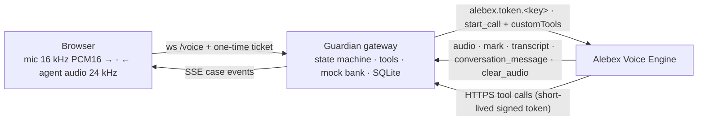

# RBC Guardian: browser voice fraud-defence network (P1)

> **Hackathon concept demo. Not an official RBC product. No real banking action is performed.**

**The bank proves itself first.** Guardian is a browser voice experience in which specialised Alebex voice agents authenticate *themselves* to the customer with a one-time phrase, help them judge a suspicious call or purchase, and take protective mock action only with explicit consent. Every step is visible live in a fraud case and audit trail.

| Agent | Direction (browser only) | Voice | Can |
|---|---|---|---|
| **Maya**, Guardian TrustLine | You call in to report a suspicious call or text | Warm, unhurried | Open a case, issue a phrase, record answers, request review |
| **Atlas**, Fraud Sentinel | A simulated incoming Guardian call after the mock fraud engine flags a purchase | Calm, concise | Also read transactions, lock the card, flag the purchase |
| **Nora**, Recovery Specialist | A new call that continues an existing case | Empathetic | Read the case, record answers, request review |

**No telephony and no deployment.** P1 has no Twilio, no phone numbers and no `POST /public/call/phone`. "Inbound" and "outbound" are browser workflows. Nothing is deployed to Vercel or any other host.

## Architecture



The Alebex key never leaves the gateway. The browser talks only to the gateway, which opens the Alebex socket, builds least-privilege Custom Tools per role, and records every action. See [docs/ARCHITECTURE.md](docs/ARCHITECTURE.md).

## Prerequisites

- Node ≥ 22.13 (developed on Node 25; SQLite uses the built-in `node:sqlite`)
- pnpm 10: `npm i -g pnpm@10`
- A current Chrome, Edge, Firefox or Safari with a microphone; a headset for live mode
- For live mode: an Alebex account with a Voice Engine key and one to three agents

## Quick start: mock mode (offline, no credentials)

```bash
pnpm install
cp .env.example .env        # ALEBEX_MODE=mock is the default
pnpm dev                    # web on :3000, gateway on :3001
```

Open http://localhost:3000, then click **Launch the live demo**, then **Trigger fraud detection**, then **Answer**. The mock engine has no speech recognition, so click the suggested replies to speak. Agent audio is a soft tone.

## Quick start: live mode (Alebex Voice Engine)

1. Create the three agents in the Alebex console with the prompts in [docs/ALEBEX_AGENT_SETUP.md](docs/ALEBEX_AGENT_SETUP.md).
2. Fill in `.env`:
   ```bash
   ALEBEX_MODE=live
   ALEBEX_API_KEY=wt_...                  # server-side only
   ALEBEX_AGENT_TRUSTLINE_ID=...
   ALEBEX_AGENT_SENTINEL_ID=...
   ALEBEX_AGENT_RECOVERY_ID=...           # or ALEBEX_AGENT_DEFAULT_ID for all three
   TOOL_SIGNING_SECRET=<32+ random chars>
   ```
3. Check the setup: `pnpm probe:alebex`, then `pnpm smoke:live --role sentinel`.
4. `pnpm dev`, then open `/settings` to confirm readiness and `/demo` to run the call.

### Custom Tools need a public HTTPS URL

Alebex calls tools from its own servers, so `/tools/*` must be reachable over public HTTPS: no `http://`, no loopback, no redirects.

```bash
pnpm tunnel     # uses an installed cloudflared or ngrok; installs nothing
# copy the https URL into .env:
PUBLIC_TOOL_BASE_URL=https://<your-tunnel>.trycloudflare.com
# restart pnpm dev
```

A temporary tunnel is fine for P1; it is not a deployment. Every tool request must carry a per-session HMAC token that expires with the call. Without `PUBLIC_TOOL_BASE_URL`, live mode runs **voice-only**: tools are disabled, Diagnostics shows a warning, and **Operator controls** in the control room apply the same case actions by hand.

## Commands

| Command | What it does |
|---|---|
| `pnpm dev` | Gateway (:3001) and web (:3000) with reload |
| `pnpm lint` / `pnpm typecheck` | ESLint (with React hook rules) / strict TypeScript across the workspace |
| `pnpm test` | Unit tests: DSP, protocol parser, playback and marks, risk, redaction, tools, tokens, env, components |
| `pnpm test:integration` | Gateway ↔ mock Alebex over real sockets: handshake, forwarding, marks, clear_audio, tools, errors, SSE |
| `pnpm test:e2e` | Playwright in mock mode with a fake microphone (`CAPTURE_SCREENSHOTS=1` refreshes `docs/screenshots`) |
| `pnpm build` | Builds every package, the gateway bundle and the Next.js app |
| `pnpm probe:alebex` | Live protocol probe (skips cleanly without a token; `--auth-only` for handshake only) |
| `pnpm smoke:live [--role r]` | Live call through the gateway to the real engine |
| `pnpm secret-scan` | Scans tracked files and the client bundle for secrets |
| `pnpm tunnel` | Temporary public HTTPS tunnel for tools |

## Demo flow

1. The landing page explains the idea. Launch the demo.
2. **Trigger fraud detection**: CAD $2,840, Apple Store, Miami, unknown device, **risk 92**.
3. **Answer** the simulated Guardian call from Atlas.
4. Atlas promises never to ask for a password, PIN or code, issues a **reverse-auth phrase** that appears on screen, and reads it. You confirm it matches.
5. "That wasn't me, and someone called asking for a code." Risk rises to **99**.
6. "Yes, lock it." The card is locked, the purchase flagged and human review queued, all mock. A duplicate lock call is visibly ignored.
7. **End call**, then open the **Command Center**: signals, risk history, audit trail, tool calls, redacted transcript, JSON export.
8. Optional: **Continue with Nora** (a different agent and voice), or **Call Guardian TrustLine** (Maya).

Script with exact presenter lines and a 90-second version: [docs/DEMO_SCRIPT.md](docs/DEMO_SCRIPT.md).

## P1 limitations

- Browser voice only. There is no real inbound or outbound telephony.
- Prompts, voices and models are set in the Alebex console; the app selects agent IDs only.
- Live tools require a public HTTPS URL. Live tool calls have **not** been exercised against the real engine yet; the live voice path has.
- All banking data and actions are sandbox rows in local SQLite.
- The demo APIs are unauthenticated and intended for localhost.

Full list: [docs/KNOWN_LIMITATIONS.md](docs/KNOWN_LIMITATIONS.md).

## Documentation

[Architecture](docs/ARCHITECTURE.md) · [Alebex protocol notes](docs/ALEBEX_PROTOCOL_NOTES.md) · [Agent setup](docs/ALEBEX_AGENT_SETUP.md) · [Demo script](docs/DEMO_SCRIPT.md) · [Security and privacy](docs/SECURITY_AND_PRIVACY.md) · [Test report](docs/TEST_REPORT.md) · [Iteration log](docs/ITERATION_LOG.md) · [Known limitations](docs/KNOWN_LIMITATIONS.md) · [Handoff](HANDOFF.md)
