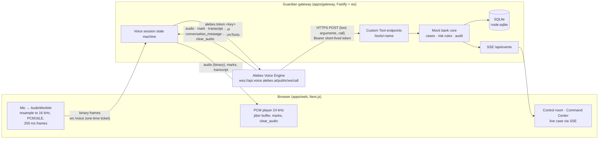

# Architecture

> Hackathon concept demo. Not an official RBC product. No real banking action is performed.

## System

In mock mode, the gateway starts an Alebex-compatible mock engine in-process (`apps/gateway/src/mock/mock-alebex.ts`). It speaks the live-confirmed frames and calls the tools over HTTP with their signed headers, just as the engine does.

## Packages

| Package | Responsibility |
|---|---|
| `packages/alebex-protocol` | The only code that knows Alebex frame layouts: parser (confirmed shapes only), `start_call` builder, PCM16 conversion, deterministic streaming resampler, 200 ms framer, playback timeline with mark accounting, transcript snapshot store. Pure TypeScript, used by the browser, the gateway, the mock and the probe |
| `packages/shared` | Domain types, the tool catalog (JSON Schema in the Alebex subset plus Zod validators), role allowlists, deterministic risk scoring, redaction, the browser↔gateway wire protocol |
| `apps/gateway` | Env validation, session manager and voice session state machine, tool service with auth, idempotency and audit, case service, SQLite store, SSE bus, diagnostics, mock engine |
| `apps/web` | Landing page, `/demo` control room, `/cases/[id]` Command Center, `/settings` diagnostics; `useVoiceCall` (mic, player, socket) and `useCase` (SSE-driven case view) |

## A call, step by step

1. **Browser** `POST /api/sessions {role, caseId?}`. The gateway checks the role allowlist, resolves the case (Sentinel needs the detected case, TrustLine creates an intake case, Recovery takes an existing one), stores a `VoiceSession`, and returns `{sessionId, ticket}`. The ticket is HMAC-signed, valid for 60 s and single-use.
2. **Browser** opens `ws://gateway/voice?sid=…` with subprotocol `guardian.ticket.<ticket>`, so the ticket never appears in a URL. It is rejected on a bad or reused ticket (`4401`), a foreign `Origin` (403), or a session that already has a socket (`4409`).
3. **Gateway** mints a per-session tool token (`{sid, role, tools, exp}`, HMAC), builds `customTools` for the role, and opens the Alebex socket with `alebex.token.<key>`. It sends `start_call` exactly once.
4. **States:** `idle → connecting_upstream → starting → active → ending → ended`, with `error → ended` from any live state. Invalid transitions throw. The call becomes `active` on the first non-error engine frame, or 1.5 s after `start_call`.
5. **Mic frames** are forwarded as-is. Odd-length, empty or oversized (>32 kB) frames are dropped, and frames are dropped when the upstream buffer exceeds 512 kB (backpressure: stale audio is worse than a gap). There is a message-rate cap of 80/s.
6. **Engine frames** are parsed: audio is decoded from base64 and sent to the browser as binary; marks are remembered and forwarded; transcripts and messages are forwarded, and committed messages are stored redacted.
7. **Browser playback** schedules each chunk on an `AudioContext`. When the audio before a mark has actually played, the browser sends `mark_played`, and the gateway forwards the original mark object once, and only if it issued it. `clear_audio` stops queued sources immediately and drops pending marks.
8. **Tools:** Alebex POSTs to `PUBLIC_TOOL_BASE_URL/tools/<name>?s=<sid>`. The gateway verifies the token signature and expiry, that the header session, URL session and token all match, the role allowlist, the envelope shape, that the call is still live, and the arguments via Zod. It then applies idempotency and executes. Each tool writes an audit record and case events; SSE pushes them to the UI.
9. **End:** the browser sends `end`. The gateway sends `end_call`, finishes on `call_ended` (or after a 2 s grace), closes the upstream, then closes the browser socket with 1000. If the browser disconnects, the gateway sends `end_call` itself. If the upstream drops, the browser gets a recoverable `upstream_lost` (4502). Completed actions are kept, and the user starts a new call rather than resuming.

## Modes

| Mode | When | Voice | Tools |
|---|---|---|---|
| `mock` | `ALEBEX_MODE=mock` (default) | In-process mock engine; tone audio, scripted agents, reply chips instead of speech recognition | Called over local HTTP with real signed tokens |
| `live` | `ALEBEX_MODE=live` + token + agent + `PUBLIC_TOOL_BASE_URL` | Alebex | Alebex calls the public tunnel URL |
| `live-voice-only` | Live without a public tool URL | Alebex | Omitted from `start_call`; operator controls apply the same case actions, labelled "operator action" |

## Data model (SQLite, JSON documents)

`customers`, `transactions`, `cases` (`GuardianCase`: status, risk score and history, reverse-auth phrase, lock/flag/review state, customer responses), `sessions`, `messages` (redacted), `tool_invocations` (redacted argument and result summaries), `case_events` (the audit trail), `idempotency` (key → first result), and `kv` (last probe result).

No password, PIN, OTP, CVV or full card number is ever stored: the tools do not accept them, and free text is redacted before storage.

## Risk scoring

The rules in `packages/shared/src/risk.ts` are deterministic, and every point maps to a named signal:

| Signal | Points |
|---|---|
| Baseline | 10 |
| New location (out of home region or country) | 30 |
| Unknown device | 20 |
| Amount ≥ 3× typical purchase | 22 |
| No travel notice, foreign purchase | 10 |
| Customer denies the transaction | 4 |
| Bank-impersonation contact reported | 30 |
| Caller asked for a verification code | 25 |
| Customer shared a code | 20 |
| Reverse-auth phrase mismatch | 15 |

The score is capped at 99. For the seeded case: 92 at detection, 96 after the denial, 99 after the code request. If the customer recognises the purchase, the transaction signals are dropped.

## Future P2: telephony

A telephony adapter would implement the same `VoiceSession` upstream contract using `POST /public/call/phone` and Twilio. The tool service, case core, risk rules and UI would not change; the call's `callType` becomes `phone` and the end-of-call webhook becomes worth wiring.
